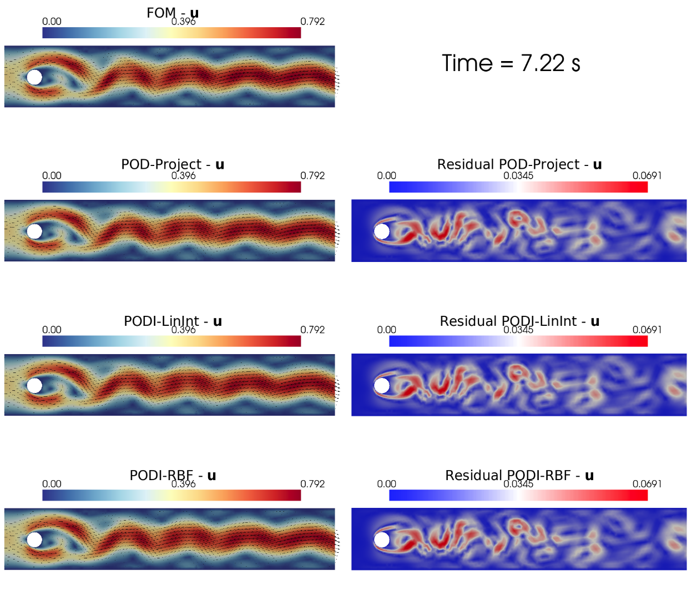
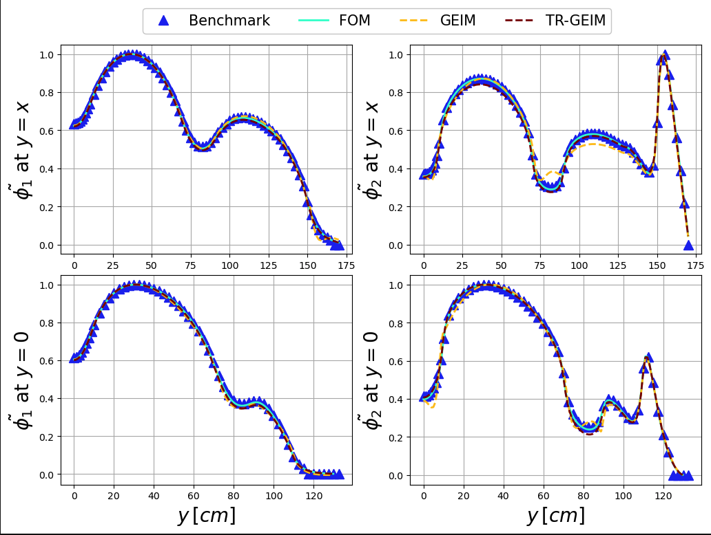

<p align="center">
  <a href="https://github.com/ERMETE-Lab" target="_blank" >
    
  </a>
</p>


<p align="center">
  <a href="https://doi.org/10.21105/joss.06950">
    
  </a>
  <a href="https://doi.org/10.1016/j.nucengdes.2024.113105">
    
  </a>
  <a href="https://doi.org/10.1016/j.apm.2024.06.040">
    
  </a>
</p>

<p align="center">
  <a href="https://ermete-lab.github.io/ROSE-pyforce/intro.html">
    
  </a>
  <a href="https://zenodo.org/records/15705990">
    
  </a>
  <a href="https://github.com/ERMETE-Lab/ROSE-pyforce/actions/workflows/testing.yml">
    
  </a>
</p>

**pyforce: Python Framework data-driven model Order Reduction for multi-physiCs problEms**

- [Description](#description)
- [How to cite *pyforce*](#how-to-cite-pyforce)
  - [Selected works with *pyforce*](#selected-works-with-pyforce)
- [Installation](#installation)
- [Package Structure](#package-structure)
- [Tutorials](#tutorials)
  - [Demo results](#demo-results)
- [Authors and contributions](#authors-and-contributions)
- [Community Guidelines](#community-guidelines)
  - [Contribute to the Software](#contribute-to-the-software)
  - [Reporting Issues or Problems](#reporting-issues-or-problems)
  - [Seeking Support](#seeking-support)

## Description

*pyforce* is a Python package implementing Data-Driven Reduced Order Modelling (DDROM) techniques for applications to multi-physics problems, mainly set in the **Nuclear Engineering** world. These techniques have been implemented upon the [dolfinx](https://github.com/FEniCS/dolfinx) package (currently v0.6.0), part of the [FEniCSx](https://fenicsproject.org/) project, to handle mesh generation, integral calculation and functions storage. The package is part of the **ROSE (Reduced Order modelling with data-driven techniques for multi-phySics problEms)**: mathematical algorithms aimed at reducing the complexity of multi-physics models (for nuclear reactors applications), at searching for optimal sensor positions and at integrating real measures to improve the knowledge on the physical systems.

The techniques implemented here follow the same underlying idea expressed in the following figure: in the offline (training) phase, a dimensionality reduction process retrieves a reduced coordinate system onto which encodes the information of the mathematical model; the sensor positioning algorithm then uses this set to select the optimal location of sensors according to some optimality criterion, which depends on the adopted algorithm. In the online phase, the DA process begins, retrieving a novel set of reduced variables and then computing the reconstructed state through a decoding step.

<p align="center">
  
  </a>
</p>

At the moment, the following techniques have been implemented:

- **Proper Orthogonal Decomposition** with Projection and Interpolation for the Online Phase -> [`pyforce.offline.POD`](https://ermete-lab.github.io/ROSE-pyforce/_modules/pyforce/offline/pod.html#POD), [`pyforce.online.pod_projection`](https://ermete-lab.github.io/ROSE-pyforce/_modules/pyforce/online/pod_projection.html#PODproject), [`pyforce.online.pod_interpolation`](https://ermete-lab.github.io/ROSE-pyforce/_modules/pyforce/online/pod_interpolation.html#PODI)
- **Generalised Empirical Interpolation Method**, either regularised with Tikhonov or not -> [`pyforce.offline.geim`](https://ermete-lab.github.io/ROSE-pyforce/_modules/pyforce/offline/geim.html#GEIM), [`pyforce.online.geim`](https://ermete-lab.github.io/ROSE-pyforce/_modules/pyforce/online/geim.html#GEIM), [`pyforce.online.tr_geim`](https://ermete-lab.github.io/ROSE-pyforce/_modules/pyforce/online/tr_geim.html#TRGEIM)
- **Parameterised-Background Data-Weak formulation** -> [`pyforce.online.pbdw`](https://ermete-lab.github.io/ROSE-pyforce/_modules/pyforce/online/pbdw.html#PBDW)
- an **Indirect Reconstruction** algorithm to reconstruct non-observable fields -> [`pyforce.online.indirect_recon`](https://ermete-lab.github.io/ROSE-pyforce/api/pyforce.online.html#module-pyforce.online.indirect_recon)

This package is aimed to be a valuable tool for other researchers, engineers, and data scientists working in various fields, not only restricted in the Nuclear Engineering world.

## How to cite *pyforce*

If you use *pyforce* in your research, please cite the **JOSS paper** as the primary software reference.

1. **[Software Reference]** S. Riva, C. Introini, and A. Cammi, "pyforce: Python Framework for data-driven model Order Reduction of multi-physiCs problems," *Journal of Open Source Software*, vol. 11, no. 117, p. 6950, 2026. [https://doi.org/10.21105/joss.06950](https://doi.org/10.21105/joss.06950)

For the original papers, with applications on nuclear reactors (multiphysics modelling), please also cite:

2. **[Model Bias Correction]** S. Riva, C. Introini, and A. Cammi, "Multi-physics model bias correction...", *Applied Mathematical Modelling*, 2024. [https://doi.org/10.1016/j.apm.2024.06.040](https://doi.org/10.1016/j.apm.2024.06.040)
3. **[Sensor Positioning and Indirect Reconstruction]** A. Cammi, S. Riva, et al., "Data-driven model order reduction...", *Nuclear Engineering and Design*, 2024. [https://doi.org/10.1016/j.nucengdes.2024.113105](https://doi.org/10.1016/j.nucengdes.2024.113105)

For LaTeX users:

```bibtex

@article{pyforce_JOSS,
  doi = {10.21105/joss.06950},
  url = {[https://doi.org/10.21105/joss.06950](https://doi.org/10.21105/joss.06950)},
  year = {2026},
  publisher = {The Open Journal},
  volume = {11},
  number = {117},
  pages = {6950},
  author = {Stefano Riva and Carolina Introini and Antonio Cammi},
  title = {pyforce: Python Framework for data-driven model Order Reduction of multi-physiCs problems},
  journal = {Journal of Open Source Software}
}

@article{RIVA2024_AMM,
title = {Multi-physics model bias correction with data-driven reduced order techniques: Application to nuclear case studies},
journal = {Applied Mathematical Modelling},
volume = {135},
pages = {243-268},
year = {2024},
issn = {0307-904X},
doi = {https://doi.org/10.1016/j.apm.2024.06.040},
url = {https://www.sciencedirect.com/science/article/pii/S0307904X24003196},
author = {Stefano Riva and Carolina Introini and Antonio Cammi},
keywords = {Reduced order modelling, Data driven, Nuclear reactors, Multi-physics, Model correction},
}

@article{CAMMI2024_NED,
title = {Data-driven model order reduction for sensor positioning and indirect reconstruction with noisy data: Application to a Circulating Fuel Reactor},
journal = {Nuclear Engineering and Design},
volume = {421},
pages = {113105},
year = {2024},
issn = {0029-5493},
doi = {https://doi.org/10.1016/j.nucengdes.2024.113105},
url = {https://www.sciencedirect.com/science/article/pii/S002954932400205X},
author = {Antonio Cammi and Stefano Riva and Carolina Introini and Lorenzo Loi and Enrico Padovani},
keywords = {Hybrid Data-Assimilation, Generalized Empirical Interpolation Method, Indirect Reconstruction, Sensors positioning, Molten Salt Fast Reactor, Noisy data},
}

```

### Selected works with *pyforce*

- S. Riva, S. Deanesi, C. Introini, S. Lorenzi, and A. Cammi, “Neutron flux reconstruction from out-core sparse measurements using data-driven reduced order modelling,” in Proceedings of the International Conference on Physics of Reactors, PHYSOR 2024, p. 1632 – 1641, 2024. doi:10.13182/PHYSOR24-43444.
- M. Lo Verso, S. Riva, C. Introini, E. Cervi, F. Giacobbo, L. Savoldi, M. Di Prinzio, M. Caramello, L. Barucca, and A. Cammi, “Application of a non-intrusive reduced order modeling approach to magnetohydrodynamics,” Physics of Fluids, vol. 36, p. 107167, 10 2024. doi:10.1063/5.0230708.
- S. Riva, C. Introini, E. Zio, and A. Cammi, “Impact of malfunctioning sensors on data-driven reduced order modelling: Application to molten salt reactors,” EPJ Web Conf., vol. 302, p. 17003, 2024. doi:10.1051/epjconf/202430217003.
- C. G. De Lurion De L’Égouthail, L. Loi, S. Riva, C. Introini, and A. Cammi, “Shadowing Effect Correction for the Pavia TRIGA Reactor Using Monte Carlo Data and Reduced Order Modelling Techniques,” in The 33rd International Conference Nuclear Energy for New Europe (NENE2024), (Portoroz, Slovenia), September 2024.
- S. Riva, C. Introini, A. Cammi, and J. N. Kutz, “Robust state estimation from partial out-core measurements with shallow recurrent decoder for nuclear reactors,” Progress in Nuclear Energy, vol. 189, p. 105928, 2025. URL: https://www.sciencedirect.com/science/article/pii/S0149197025003269, doi:10.1016/j.pnucene.2025.105928
-  W. Duan, C. Introini, A. Cammi, K. Zhang, S. Dong, and H. Chen, “State prediction and analysis of 3D upper plenum of lead–bismuth fast reactor based on model order reduction under transient accidents,” Nuclear Engineering and Design, vol. 445, p. 114447, 2025. URL: https://www.sciencedirect.com/science/article/pii/S0029549325006247, doi:10.1016/j.nucengdes.2025.114447.

## Installation
The package can be installed using `pip`, make sure all the dependencies are installed (following these [steps](https://ermete-lab.github.io/ROSE-pyforce/installation.html#set-up-a-conda-environment-for-pyforce)). The requirements are listed [here](https://github.com/ERMETE-Lab/ROSE-pyforce/blob/main/pyforce/requirements.txt).

It is suggested to create a conda environment: at first, clone the repository
```bash
git clone https://github.com/ERMETE-Lab/ROSE-pyforce.git
```
create a conda environment using `environment.yml`
```bash
cd ROSE-pyforce
conda env create -f pyforce/environment.yml
```
activate the environment and then install the package using `pip` (be aware than on PyPI there exists another package named *pyforce*, so be sure to install it from the cloned repository)
```bash
conda activate pyforce-env
cd pyforce/
python -m pip install .
```

## Package Structure
The package **pyforce** comprises 3 subpackages: *offline*, *online* and *tools*. The first two collect the main functionalities, in particular the different DDROM techniques; whereas, the last includes importing and storing functions (from *dolfinx* directly or mapping from OpenFOAM), some backend classes for the snapshots and the calculation of integrals/norms. In the following, some figures are sketching how the different classes are connected to each other during the offline and online phases.

More details on how the classes are connected to each other (both during the offline and online phases) can be found in the [docs](https://ermete-lab.github.io/ROSE-pyforce/theory.html#package-structure).

## Tutorials
The *pyforce* package is tested on some tutorials available in the [docs](https://ermete-lab.github.io/ROSE-pyforce/tutorials.html), including fluid dynamics and neutronics problems.

1. Laminar Flow over Cylinder (DFG2 benchmark): solved with *dolfinx*;
2. Multi-Group Neutron Diffusion (ANL11-A2 benchmark): solved in *dolfinx*.
3. Differentially Heated Cavity (buoyant Navier-Stokes): solved with OpenFOAM-6, as in [ROM4FOAM tutorial](https://ermete-lab.github.io/ROSE-ROM4FOAM/Tutorials/BuoyantCavity/problem.html).

*Coming Soon*: multiphysics (neutronics+thermal-hydraulics) with *dolfinx* and OpenFOAM.

The snapshots can be either generated by the user or be downloaded at the following link [](https://zenodo.org/records/15705990)

### Demo results

Two demo results are reported here for a quick overview of the package capabilities, for the POD with Interpolation and for the GEIM with Tikhonov Regularisation. More details can be found in the [docs](https://ermete-lab.github.io/ROSE-pyforce/tutorials.html).

- **POD** with **Interpolation** on the Laminar Flow over Cylinder tutorial: in the following block, a code-block will be reported to show how to generate the POD basis from a set of train snapshots (offline phase) and how to perform the online phase and the state reconstruction
```python
# Offline Phase
from pyforce.offline.pod import POD
pod_off = POD(train_snaps : FunctionsList, var_name,  verbose = True)
pod_off.compute_basis(train_snaps : FunctionsList, rank)

...

# Online Phase
from pyforce.online.pod_interpolation import PODI
podi = PODI(pod_modes: FunctionsList, coefficients_maps: list, var_name)
reconstruction = podi.reconstruct(test_snaps: FunctionsList, test_params: list, basis_to_use: int)
```
<p align="center">
  
</p>

- **GEIM** with **Tikhonov Regularisation** on the Multi-Group Neutron Diffusion tutorial: in the following block, a code-block will be reported to show how to generate the GEIM basis and sensors from a set of train snapshots (offline phase) and how to perform the online phase and the state reconstruction
```python
# Offline Phase
from pyforce.offline.geim import GEIM
geim_off = GEIM(mesh: dolfinx.mesh.Mesh, V: FunctionSpace, var_name, sensor_point_spread)
geim_off.offline(train_snaps : FunctionsList, Max_Sensors: int, verbose = True)

# Online Phase
from pyforce.online.tr_geim import TRGEIM
trgeim = TRGEIM(magic_functions: FunctionsList, magic_sensors: FunctionsList, mean_offline_beta_coeffs: np.ndarray, std_offline_beta_coeffs: np.ndarray, var_name)
trgeim.reconstruct(test_snaps: FunctionsList, M_to_use, noise_value, reg_param = noise_value**2)
```
<p align="center">
  
</p>


## Authors and contributions

**pyforce** is currently developed and mantained at [Nuclear Reactors Group - ERMETE Lab](https://github.com/ERMETE-Lab) by

- Stefano Riva
- Carolina Introini

under the supervision of Prof. Antonio Cammi.

If interested, please contact stefano.riva@polimi.it, carolina.introini@polimi.it, antonio.cammi@polimi.it

## Community Guidelines

We welcome contributions and feedback from the community! Below are the guidelines on how to get involved:

### Contribute to the Software
If you would like to contribute, please follow these steps:

1. Fork the repository.
2. Implement your changes. If you're adding new features, we kindly ask that you include an example demonstrating how to use them.
3. Submit a pull request for review.

### Reporting Issues or Problems
If you encounter any issues or bugs with *pyforce*, please report them through the GitHub [Issues](https://github.com/ERMETE-Lab/ROSE-pyforce/issues) page. Be sure to include detailed information to help us resolve the problem efficiently.

### Seeking Support
For support, you can either:
- Open a discussion on the GitHub [Discussions](https://github.com/ERMETE-Lab/ROSE-pyforce/discussions) page.
- Send an email directly to: [stefano.riva@polimi.it](mailto:stefano.riva@polimi.it) or [carolina.introini@polimi.it](mailto:carolina.introini@polimi.it)

Thank you for helping improve **pyforce**!
