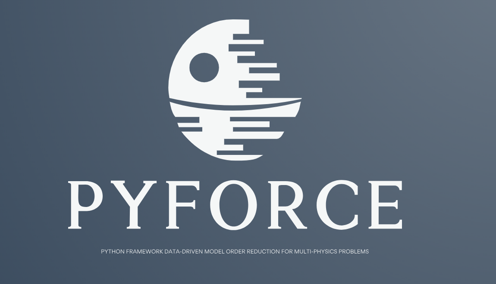
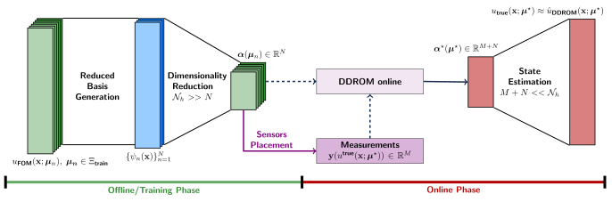

<p align="center">
  <a href="https://github.com/ERMETE-Lab" target="_blank" >
    
  </a>
</p>

[](https://doi.org/10.1016/j.apm.2024.06.040) [](https://www.sciencedirect.com/science/article/pii/S002954932400205X)

[](https://ermete-lab.github.io/ROSE-pyforce/intro.html) [](https://ermete-lab.github.io/ROSE-pyforce/tutorials.html)


[](https://github.com/Steriva/ROSE-pyforce/actions/workflows/testing.yml) [](https://github.com/ERMETE-Lab/ROSE-pyforce/actions/workflows/draft-pdf.yml)

**pyforce: Python Framework data-driven model Order Reduction for multi-physiCs problEms**

- [Description](#description)
- [How to cite *pyforce*](#how-to-cite-pyforce)
  - [Recent works with *pyforce*](#recent-works-with-pyforce)
- [Installation](#installation)
- [Tutorials](#tutorials)
- [Authors and contributions](#authors-and-contributions)
- [Community Guidelines](#community-guidelines)
  - [Contribute to the Software](#contribute-to-the-software)
  - [Reporting Issues or Problems](#reporting-issues-or-problems)
  - [Seeking Support](#seeking-support)

## Description

*pyforce* is a Python package implementing Data-Driven Reduced Order Modelling (DDROM) techniques for applications to multi-physics problems, mainly set in the **Nuclear Engineering** world. These techniques have been implemented upon the [dolfinx](https://github.com/FEniCS/dolfinx) package (currently v0.6.0), part of the [FEniCSx](https://fenicsproject.org/) project, to handle mesh generation, integral calculation and functions storage. The package is part of the **ROSE (Reduced Order modelling with data-driven techniques for multi-phySics problEms)**: mathematical algorithms aimed at reducing the complexity of multi-physics models (for nuclear reactors applications), at searching for optimal sensor positions and at integrating real measures to improve the knowledge on the physical systems.

The techniques implemented here follow the same underlying idea expressed in the following figure: in the offline (training) phase, a dimensionality reduction process retrieves a reduced coordinate system onto which encodes the information of the mathematical model; the sensor positioning algorithm then uses this set to select the optimal location of sensors according to some optimality criterion, which depends on the adopted algorithm. In the online phase, the DA process begins, retrieving a novel set of reduced variables and then computing the reconstructed state through a decoding step.

<p align="center">
  
  </a>
</p>

At the moment, the following techniques have been implemented:

- **Proper Orthogonal Decomposition** with Projection and Interpolation for the Online Phase
- **Generalised Empirical Interpolation Method**, either regularised with Tikhonov or not
- **Parameterised-Background Data-Weak formulation**
- an **Indirect Reconstruction** algorithm to reconstruct non-observable fields

This package is aimed to be a valuable tool for other researchers, engineers, and data scientists working in various fields, not only restricted in the Nuclear Engineering world.

## How to cite *pyforce*

If you are going to use *pyforce* in your research work, please cite the following articles.
The authors would be pleased if you could cite the relevant papers:

1. Stefano Riva, Carolina Introini, and Antonio Cammi, “Multi-physics model bias correction with data-driven reduced order techniques: Application to nuclear case studies,” Applied Mathematical Modelling, vol. 135, pp. 243–268, 2024. [https://doi.org/10.1016/j.apm.2024.06.040](https://doi.org/10.1016/j.apm.2024.06.040).
2. Antonio Cammi, Stefano Riva, Carolina Introini, Lorenzo Loi, and Enrico Padovani. Data-driven model order reduction for sensor positioning and indirect reconstruction with noisy data: Application to a circulating fuel reactor. Nuclear Engineering and Design, 421:113105, 2024. doi:[https://doi.org/10.1016/j.nucengdes.2024.113105](https://doi.org/10.1016/j.nucengdes.2024.113105).

For LaTeX users:

```bibtex

@article{RIVA2024_AMM,
title = {Multi-physics model bias correction with data-driven reduced order techniques: Application to nuclear case studies},
journal = {Applied Mathematical Modelling},
volume = {135},
pages = {243-268},
year = {2024},
issn = {0307-904X},
doi = {https://doi.org/10.1016/j.apm.2024.06.040},
url = {https://www.sciencedirect.com/science/article/pii/S0307904X24003196},
author = {Stefano Riva and Carolina Introini and Antonio Cammi},
keywords = {Reduced order modelling, Data driven, Nuclear reactors, Multi-physics, Model correction},
}

@article{CAMMI2024_NED,
title = {Data-driven model order reduction for sensor positioning and indirect reconstruction with noisy data: Application to a Circulating Fuel Reactor},
journal = {Nuclear Engineering and Design},
volume = {421},
pages = {113105},
year = {2024},
issn = {0029-5493},
doi = {https://doi.org/10.1016/j.nucengdes.2024.113105},
url = {https://www.sciencedirect.com/science/article/pii/S002954932400205X},
author = {Antonio Cammi and Stefano Riva and Carolina Introini and Lorenzo Loi and Enrico Padovani},
keywords = {Hybrid Data-Assimilation, Generalized Empirical Interpolation Method, Indirect Reconstruction, Sensors positioning, Molten Salt Fast Reactor, Noisy data},
}

```

### Selected works with *pyforce*

- Antonio Cammi, Stefano Riva, Carolina Introini, Lorenzo Loi, and Enrico Padovani. Indirect Field Recon- struction and Sensor Positioning in Circulating Fuel Reactors using Data-Driven Model Order Reduction. In 2023 International Congress on Advances in Nuclear Power Plants, Gyeongju, Korea, April 2023.
- Stefano Riva, Carolina Introini, and Antonio Cammi. Multi-Physics Model Correction with Data-Driven Reduced Order Modelling. In 32nd International Conference Nuclear Energy for New Europe (NENE2023), Portoroz, Slovenia, September 2023.
- Stefano Riva, Sophie Deanesi, Carolina Introini, Stefano Lorenzi, and Antonio Cammi. Neutron Flux Reconstruction from Out-Core Sparse Measurements using Data-Driven Reduced Order Modelling. In International Conference on Physics of Reactors (PHYSOR24), San Francisco, USA, April 2024.
- Matteo Lo Verso, Stefano Riva, Carolina Introini, Eric Cervi, Francesca Giacobbo, Laura Savoldi, Marcello Di Prinzio, Marco Caramello, Luciana Barucca, and Antonio Cammi, “Application of a non-intrusive Reduced Order Modelling approach to Magneto-HydroDynamics,” accepted for publication in Physics of Fluids, 2024.
- Stefano Riva, Carolina Introini, Antonio Cammi, and J. Nathan Kutz, “Robust state estimation from partial out-core measurements with shallow recurrent decoder for nuclear reactors,” 2024. preprint available at [https://arxiv.org/abs/2409.12550](https://arxiv.org/abs/2409.12550).
- Stefano Riva, Carolina Introini, Enrico Zio, and Antonio Cammi, “Impact of Malfunctioning Sensors on Data-Driven Reduced Order Modelling: Application to Molten Salt Reactors,” EPJ Web Conf., vol. 302, p. 17003, 2024.


## Installation
The package can be installed using `pip`, make sure all the dependencies are installed (following these [steps](https://ermete-lab.github.io/ROSE-pyforce/installation.html#set-up-a-conda-environment-for-pyforce)). The requirements are listed [here](https://github.com/ERMETE-Lab/ROSE-pyforce/blob/main/pyforce/requirements.txt).

It is suggested to create a conda environment: at first, clone the repository
```bash
git clone https://github.com/ERMETE-Lab/ROSE-pyforce.git
```
create a conda environment using `environment.yml`
```bash
cd ROSE-pyforce
conda env create -f pyforce/environment.yml
```
activate the environment and then install the package using `pip`
```bash
conda activate pyforce-env
python -m pip install pyforce/
```

## Tutorials
The *pyforce* package is tested on some tutorials available in the [docs](https://ermete-lab.github.io/ROSE-pyforce/tutorials.html), including fluid dynamics and neutronics problems.

1. Laminar Flow over Cylinder (DFG2 benchmark): solved with *dolfinx*;
2. Multi-Group Neutron Diffusion (ANL11-A2 benchmark): solved in *dolfinx*.
3. Differentially Heated Cavity (buoyant Navier-Stokes): solved with OpenFOAM-6, as in [ROM4FOAM tutorial](https://ermete-lab.github.io/ROSE-ROM4FOAM/Tutorials/BuoyantCavity/problem.html).

*Coming Soon*: multiphysics (neutronics+thermal-hydraulics) with *dolfinx* and OpenFOAM.

The snapshots can be either generated by the user or be downloaded at the following link [](https://doi.org/10.5281/zenodo.11483677)

## Authors and contributions

**pyforce** is currently developed and mantained at [Nuclear Reactors Group - ERMETE Lab](https://github.com/ERMETE-Lab) by

- Stefano Riva
- Carolina Introini

under the supervision of Prof. Antonio Cammi.

If interested, please contact stefano.riva@polimi.it, carolina.introini@polimi.it, antonio.cammi@polimi.it

## Community Guidelines

We welcome contributions and feedback from the community! Below are the guidelines on how to get involved:

### Contribute to the Software
If you would like to contribute, please follow these steps:

1. Fork the repository.
2. Implement your changes. If you're adding new features, we kindly ask that you include an example demonstrating how to use them.
3. Submit a pull request for review.

### Reporting Issues or Problems
If you encounter any issues or bugs with *pyforce*, please report them through the GitHub [Issues](https://github.com/ERMETE-Lab/ROSE-pyforce/issues) page. Be sure to include detailed information to help us resolve the problem efficiently.

### Seeking Support
For support, you can either:
- Open a discussion on the GitHub [Discussions](https://github.com/ERMETE-Lab/ROSE-pyforce/discussions) page.
- Send an email directly to: [stefano.riva@polimi.it](mailto:stefano.riva@polimi.it) or [carolina.introini@polimi.it](mailto:carolina.introini@polimi.it)

Thank you for helping improve **pyforce**!
