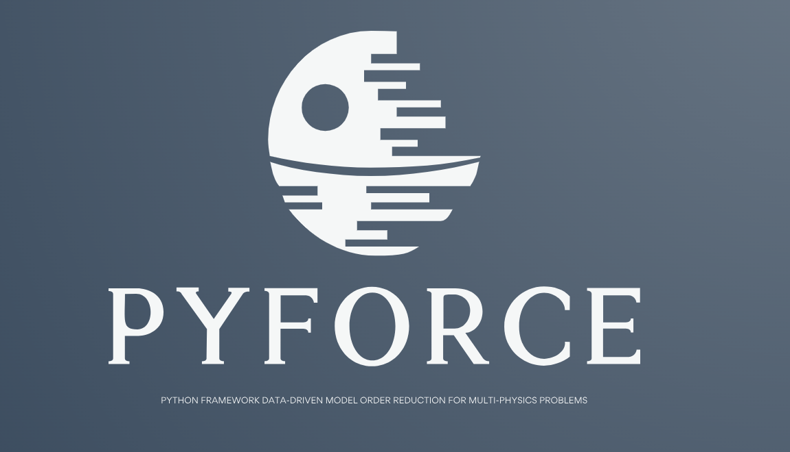
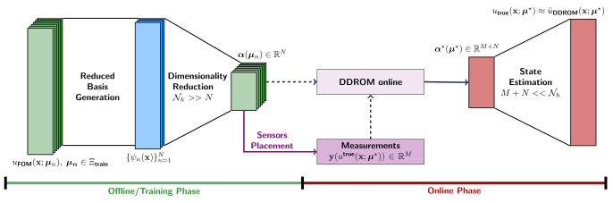
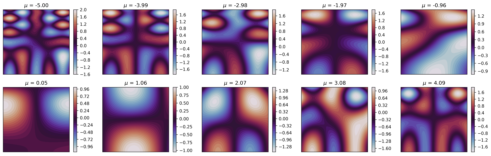
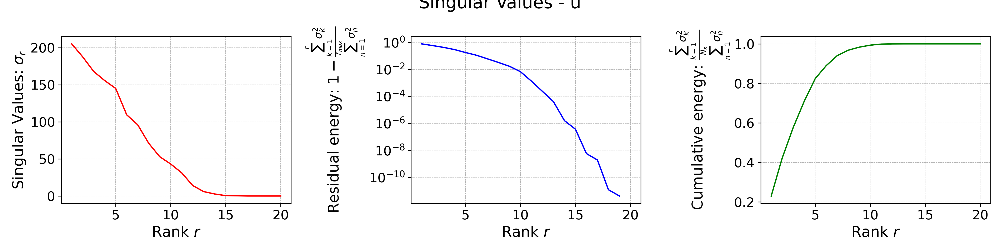
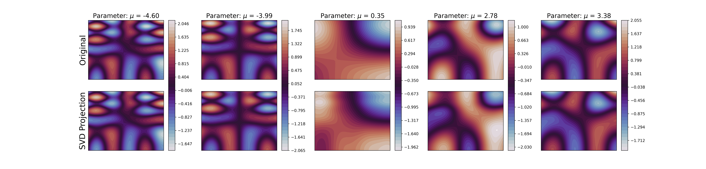

<p align="center">
  <a href="https://github.com/ERMETE-Lab" target="_blank" >
    
  </a>
</p>

<p align="center">
  <a href="https://doi.org/10.21105/joss.06950">
    
  </a>
  <a href="https://doi.org/10.1016/j.nucengdes.2024.113105">
    
  </a>
  <a href="https://doi.org/10.1016/j.apm.2024.06.040">
    
  </a>
</p>

<p align="center">
  <a href="https://ermete-lab.github.io/ROSE-pyforce/intro.html">
    
  </a>
  <a href="https://zenodo.org/records/15705990">
    
  </a>
  <a href="https://github.com/Steriva/ROSE-pyforce/actions/workflows/testing.yml">
    
  </a>
</p>

**pyforce: PYthon Framework for data-driven model Order Reduction of multi-physiCs problems**

- [Description](#description)
- [How to cite *pyforce*](#how-to-cite-pyforce)
  - [Selected works with *pyforce*](#selected-works-with-pyforce)
- [Installation](#installation)
- [Tutorials](#tutorials)
  - [Basic Demo](#basic-demo)
- [Authors and contributions](#authors-and-contributions)

## Description

*pyforce* is a Python package implementing Data-Driven Reduced Order Modelling (DDROM) techniques for applications to multi-physics problems, mainly set in the **Nuclear Engineering** world. The package is part of the **ROSE (Reduced Order modelling with data-driven techniques for multi-phySics problEms)**: mathematical algorithms aimed at reducing the complexity of multi-physics models (for nuclear reactors applications), at searching for optimal sensor positions and at integrating real measures to improve the knowledge on the physical systems.

With respect to the previous original implementation based on [dolfinx](https://github.com/FEniCS/dolfinx) package (v0.6.0), version 1.0.0 of *pyforce* has been completely re-written using `pyvista` as backend for mesh importing, computing integrals, and visualisation of results; in addition, functions are stored as `numpy` arrays, improving the ease of use of the package. **This choice allows to use *pyforce* with any software solver able to export results in VTK format.**

The techniques implemented here follow the same underlying idea expressed in the following figure: in the offline (training) phase, a dimensionality reduction process retrieves a reduced coordinate system onto which encodes the information of the mathematical model; the sensor positioning algorithm then uses this set to select the optimal location of sensors according to some optimality criterion, which depends on the adopted algorithm. In the online phase, the DA process begins, retrieving a novel set of reduced variables and then computing the reconstructed state through a decoding step [Riva et al. (2024)](https://doi.org/10.1016/j.apm.2024.06.040).

<p align="center">
  
  </a>
</p>

At the moment, the following techniques have been implemented:

- **Singular Value Decomposition** (randomised, hierchical and incremental), with Projection and Interpolation for the Online Phase -> `pyforce.offline.pod`, `pyforce.online.pod`
- **Proper Orthogonal Decomposition** with Projection and Interpolation for the Online Phase  -> `pyforce.offline.pod`, `pyforce.online.pod`
- **Empirical Interpolation Method**, either regularised with Tikhonov or not -> `pyforce.offline.eim`, `pyforce.online.eim`
- **Generalised Empirical Interpolation Method**, either regularised with Tikhonov or not -> `pyforce.offline.geim`, `pyforce.online.geim`
- **Parameterised-Background Data-Weak formulation** for Data Assimilation -> `pyforce.online.pbdw`
- **SGreedy** algorithm for optimal sensor positioning -> `pyforce.offline.sgreedy`
- an **Indirect Reconstruction** algorithm to reconstruct un-observable fields from observable ones -> `pyforce.online.indirect_reconstruction`

This package is aimed to be a valuable tool for other researchers, engineers, and data scientists working in various fields, not only restricted in the Nuclear Engineering world.

**⚠️ Important Note on Versions**
The reference paper published in JOSS [1] describes the original implementation of *pyforce* (v0.1.3), which was built upon the `dolfinx` FEM framework. **This repository hosts the new major version (v1.0.0+)**, which has been completely re-architected using `pyvista` and `numpy`. This new standalone architecture removes strict FEM dependencies, allowing *pyforce* to process results from **any solver** (e.g., OpenFOAM, Ansys, MOOSE) capable of exporting VTK/H5 files.

## How to cite *pyforce*

If you use *pyforce* in your research, please cite the **JOSS paper** as the primary software reference.
**Note:** While the JOSS paper describes the original `dolfinx`-based implementation, it remains the standard citation for the *pyforce* project until the publication of the new methodology.

1. **[Software Reference]** S. Riva, C. Introini, and A. Cammi, "pyforce: Python Framework for data-driven model Order Reduction of multi-physiCs problems," *Journal of Open Source Software*, vol. 11, no. 117, p. 6950, 2026. [https://doi.org/10.21105/joss.06950](https://doi.org/10.21105/joss.06950)

For the original papers, with applications on nuclear reactors (multiphysics modelling), please also cite:

2. **[Model Bias Correction]** S. Riva, C. Introini, and A. Cammi, "Multi-physics model bias correction with data-driven reduced order techniques: Application to nuclear case studies", *Applied Mathematical Modelling*, 2024. [https://doi.org/10.1016/j.apm.2024.06.040](https://doi.org/10.1016/j.apm.2024.06.040)
3. **[Sensor Positioning and Indirect Reconstruction]** A. Cammi, S. Riva, et al., "Data-driven model order reduction for sensor positioning and indirect reconstruction with noisy data: Application to a Circulating Fuel Reactor", *Nuclear Engineering and Design*, 2024. [https://doi.org/10.1016/j.nucengdes.2024.113105](https://doi.org/10.1016/j.nucengdes.2024.113105)

For LaTeX users:

```bibtex

@article{pyforce_JOSS,
  doi = {10.21105/joss.06950},
  url = {[https://doi.org/10.21105/joss.06950](https://doi.org/10.21105/joss.06950)},
  year = {2026},
  publisher = {The Open Journal},
  volume = {11},
  number = {117},
  pages = {6950},
  author = {Stefano Riva and Carolina Introini and Antonio Cammi},
  title = {pyforce: Python Framework for data-driven model Order Reduction of multi-physiCs problems},
  journal = {Journal of Open Source Software}
}

@article{RIVA2024_AMM,
title = {Multi-physics model bias correction with data-driven reduced order techniques: Application to nuclear case studies},
journal = {Applied Mathematical Modelling},
volume = {135},
pages = {243-268},
year = {2024},
issn = {0307-904X},
doi = {https://doi.org/10.1016/j.apm.2024.06.040},
url = {https://www.sciencedirect.com/science/article/pii/S0307904X24003196},
author = {Stefano Riva and Carolina Introini and Antonio Cammi},
keywords = {Reduced order modelling, Data driven, Nuclear reactors, Multi-physics, Model correction},
}

@article{CAMMI2024_NED,
title = {Data-driven model order reduction for sensor positioning and indirect reconstruction with noisy data: Application to a Circulating Fuel Reactor},
journal = {Nuclear Engineering and Design},
volume = {421},
pages = {113105},
year = {2024},
issn = {0029-5493},
doi = {https://doi.org/10.1016/j.nucengdes.2024.113105},
url = {https://www.sciencedirect.com/science/article/pii/S002954932400205X},
author = {Antonio Cammi and Stefano Riva and Carolina Introini and Lorenzo Loi and Enrico Padovani},
keywords = {Hybrid Data-Assimilation, Generalized Empirical Interpolation Method, Indirect Reconstruction, Sensors positioning, Molten Salt Fast Reactor, Noisy data},
}

```

### Selected works with *pyforce*

- S. Riva, S. Deanesi, C. Introini, S. Lorenzi, and A. Cammi, “Neutron flux reconstruction from out-core sparse measurements using data-driven reduced order modelling,” in Proceedings of the International Conference on Physics of Reactors, PHYSOR 2024, p. 1632 – 1641, 2024. doi:10.13182/PHYSOR24-43444.
- M. Lo Verso, S. Riva, C. Introini, E. Cervi, F. Giacobbo, L. Savoldi, M. Di Prinzio, M. Caramello, L. Barucca, and A. Cammi, “Application of a non-intrusive reduced order modeling approach to magnetohydrodynamics,” Physics of Fluids, vol. 36, p. 107167, 10 2024. doi:10.1063/5.0230708.
- S. Riva, C. Introini, E. Zio, and A. Cammi, “Impact of malfunctioning sensors on data-driven reduced order modelling: Application to molten salt reactors,” EPJ Web Conf., vol. 302, p. 17003, 2024. doi:10.1051/epjconf/202430217003.
- C. G. De Lurion De L’Égouthail, L. Loi, S. Riva, C. Introini, and A. Cammi, “Shadowing Effect Correction for the Pavia TRIGA Reactor Using Monte Carlo Data and Reduced Order Modelling Techniques,” in The 33rd International Conference Nuclear Energy for New Europe (NENE2024), (Portoroz, Slovenia), September 2024.
- S. Riva, C. Introini, A. Cammi, and J. N. Kutz, “Robust state estimation from partial out-core measurements with shallow recurrent decoder for nuclear reactors,” Progress in Nuclear Energy, vol. 189, p. 105928, 2025. URL: https://www.sciencedirect.com/science/article/pii/S0149197025003269, doi:10.1016/j.pnucene.2025.105928
-  W. Duan, C. Introini, A. Cammi, K. Zhang, S. Dong, and H. Chen, “State prediction and analysis of 3D upper plenum of lead–bismuth fast reactor based on model order reduction under transient accidents,” Nuclear Engineering and Design, vol. 445, p. 114447, 2025. URL: https://www.sciencedirect.com/science/article/pii/S0029549325006247, doi:10.1016/j.nucengdes.2025.114447.

## Installation

It is recommended to install the package in a conda environment, although it is not strictly required.

The simplest way to install the package is through using `pip`, including all the dependencies.

**Here's how**: at first, clone the repository (this will clone the official one)

```bash
git clone https://github.com/ERMETE-Lab/ROSE-pyforce.git
cd ROSE-pyforce
```

*If you want to install the development version*, clone the repo from Steriva's account

```bash
git clone --branch development --single-branch https://github.com/Steriva/ROSE-pyforce.git
cd ROSE-pyforce
```

then install the package using `pip` (this will work if you already have `python` and `pip` installed, it might not be true for `miniconda` installations):

```bash
python -m pip install rose-pyforce/
```
or equivalently

```bash
cd rose-pyforce
python -m pip install .
```

Another option is also provided adopting the `environment.yml` file as follows (If you face issues with rendering figures with `pyvista`, this might solve the problem):

```bash
conda env create -f pyforce/environment.yml
conda activate pyforce-env
python -m pip install rose-pyforce/
```

The requirements are listed [here](https://github.com/ERMETE-Lab/ROSE-pyforce/blob/main/pyforce/requirements.txt).

## Tutorials
The *pyforce* package is tested on some tutorials available in the `docs/Tutorials/` folder, including fluid dynamics, neutronics and multi-physics problems. Each tutorial includes a Jupyter notebook:

1. First steps with *pyforce*: introduction to the package and its basic features.
2. Introduction to Singular Value Decomposition (SVD) and Proper Orthogonal Decomposition (POD) and application to a fluid dynamics problem using the POD with Interpolation (POD-I) technique.
3. Presentation of (Generalised) Empirical Interpolation Method ((G)EIM) and application to a bouyancy-driven fluid dynamics problem.
4. Sensor positioning with (G)EIM and SGreedy algorithm and application of the Parameterised-Background Data-Weak (PBDW) formulation to a neutronics problem.

In addition to these basic tutorials, additional advanced tutorials are also available at `docs/Tutorials/Advanced` folder.

The snapshots can be downloaded at the following link ... or contact Stefano Riva for further information.

### Basic Demo

**Full code available in the `images/demo/pyforce_demo.ipynb` notebook.**

Consider a grid defined on the $[0,1]^2$ domain and a toy function defined as:

$$
f(x,y; \mu) = \sin(\pi \mu x) \cdot \cos(\pi \mu y) + \cos(\pi x)\cdot \sin((1-\mu) \pi y^2)
$$

where $\mu \in [-5,5]$ is a parameter. The following demo shows how to create the grid, define the snapshots, perform a train-test split, compute the SVD, plot the singular values and project a test snapshot onto the reduced space.

Square geometries can be created using `pyvista.ImageData` class. The following code creates a grid with 50x50 elements on the $[0,1]^2$ domain.

```python
import pyvista as pv

nx = 50
ny = 50
nz = 1

grid = pv.ImageData(
    dimensions=(nx+1, ny+1, nz+1),
    spacing=(1/nx, 1/ny, 1e-4),
    origin=(0.0, 0.0, 0.0)
)
```

Define the snapshots considering this toy function:

```python
from pyforce.tools.functions_list import FunctionsList
import numpy as np

X, Y = grid.points[:, 0], grid.points[:, 1]

mu_values = np.linspace(-5, 5, 100)

def harmonic_oscillator(X, Y, mu):
    term1 = np.sin(mu * np.pi * X) * np.cos(np.pi * Y)
    term2 = np.cos(np.pi * X) * np.sin((1 - mu) * np.pi * Y**2)

    return term1 + term2

snapshots = FunctionsList(dofs=len(X))

for mu in mu_values:
    snapshot = harmonic_oscillator(X, Y, mu)
    snapshots.append(snapshot)
```
<p align="center">
  
</p>

Then, split the dataset into training and testing sets:

```python
from pyforce.tools.functions_list import train_test_split

train_mu, test_mu, train_snaps, test_snaps = train_test_split(mu_values, snapshots, test_size=0.2, random_state=42)
```

Now, compute the SVD on the training snapshots, retaining 20 modes, and plot the singular values:

```python
from pyforce.offline.pod import rSVD

svd = rSVD(grid, gdim = 3)
svd.fit(train_snaps, rank = 20)
eig_fig = svd.plot_sing_vals()
```

<p align="center">
  
</p>

In the end, project a test snapshot onto the reduced space and reconstruct it:

```python
test_index = 0  # Index of the test snapshot to project
test_snapshot = test_snaps[test_index]
reduced_coeffs = svd.project(test_snapshot)
reconstructed_snapshot = svd.reconstruct(reduced_coeffs)
```

<p align="center">
  
</p>

## Authors and contributions

**pyforce** is currently developed and mantained at [Nuclear Reactors Group - ERMETE Lab](https://github.com/ERMETE-Lab) by

- Dr. Stefano Riva
- Yantao Luo

under the supervision of Dr. Carolina Introini and Prof. Antonio Cammi.

If interested, please contact stefano.riva@polimi.it, carolina.introini@polimi.it, antonio.cammi@polimi.it.
