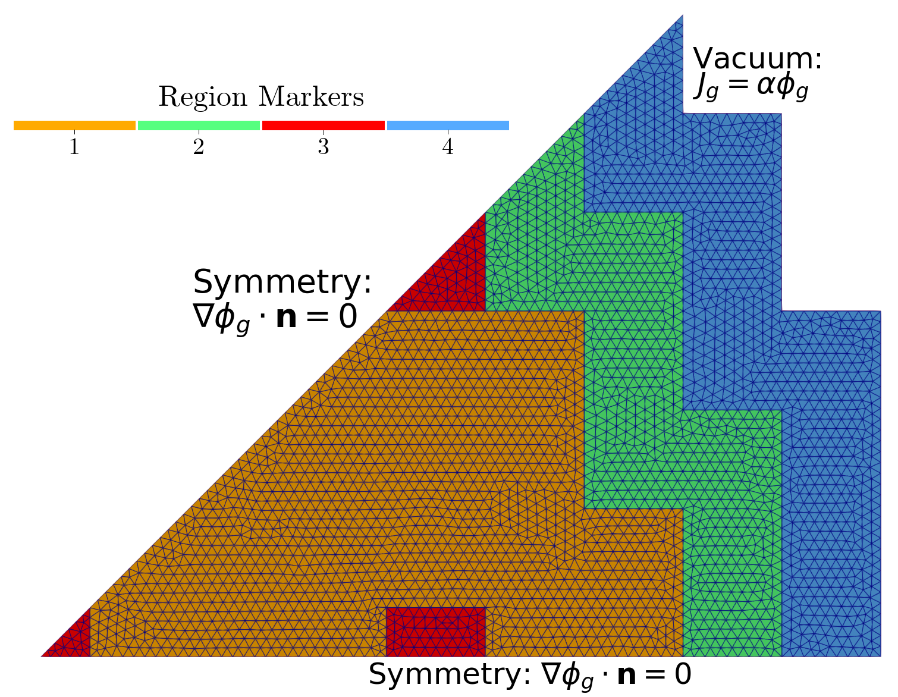

Steady State MultiGroup Diffusion for ANL11-A2 benchmark
=========================================================

**Aim of this tutorial:** learn how to generate parametric snapshots, investigate the reduction capabilities of the POD and GEIM and algorithms used for sensor placement, during the online phase the effect of random noise on the reconstruction algorithms of GEIM and PBDW will be discussed.

This tutorial wants to show how the GEIM and the PBDW can be adopted to integrate local measures and background knowledge, embedded in the basis functions, to improve the reconstruction of the solution in the online phase. Even though, the case investigate is rather simple, the same approach can be applied to more complex problems.

The ANL11-A2 benchmark is taken from the `Argonne Code Center - Supplement 2 <https://www.osti.gov/biblio/12030251>`_.
It's 2D version of a Pressurised Water Reactor with 4 regions as depicted in the following figure.

The governing equations are the eigenvalue problem for the 2-groups Neutron Diffusion:

.. math::
    \left\{
        \begin{array}{ll}
        -\nabla\cdot \left(D_1\nabla \phi_1 \right)+(\Sigma_{a,1}+\Sigma_{s,1\rightarrow 2} + D_1\,B_{z,1}^2)\phi_1 =\frac{1}{k_{eff}}\nu\Sigma_{f,2}\phi_2 & \mathbf{x}\in\Omega\\
        -\nabla\cdot \left(D_2\nabla \phi_2 \right)+(\Sigma_{a,2}+D_2\,B_{z,2}^2) \phi_2 - \Sigma_{s,1\rightarrow 2}\phi_1=0 & \mathbf{x}\in\Omega\\
        \nabla \phi_g\cdot  \mathbf{n} = -\frac{0.4692}{D_g}\,\phi_g & \mathbf{x}\in\Gamma_{vacuum} \\
        \nabla \phi_g\cdot  \mathbf{n} = 0 & \mathbf{x}\in\Gamma_{sym}
        \end{array}
    \right.

given :math:`\Omega` as the domain and :math:`\partial\Omega` as its boundary, composed by :math:`\partial\Omega = \Gamma_{sym}\cup\Gamma_{vacuum}` where :math:`\Gamma_{sym}` is the symmetry boundary and :math:`\Gamma_{vacuum}` is the end of the reactor.

.. toctree::
    :maxdepth: 3
    :caption: Steps:

    Generation of the snapshots <02_MGDiffusion/01_generate_snaps.ipynb>
    Offline Phase: POD  <02_MGDiffusion/02a_offline_POD.ipynb>
    Offline Phase: GEIM <02_MGDiffusion/02b_offline_GEIM.ipynb>
    Offline Phase: SGREEDY <02_MGDiffusion/02c_offline_SGREEDY.ipynb>
    Offline Phase: PBDW <02_MGDiffusion/02d_offline_PBDW.ipynb>
    Online Phase: GEIM and TR-GEIM <02_MGDiffusion/03a_online_GEIM.ipynb>
    Online Phase: PBDW <02_MGDiffusion/03b_online_PBDW.ipynb>
