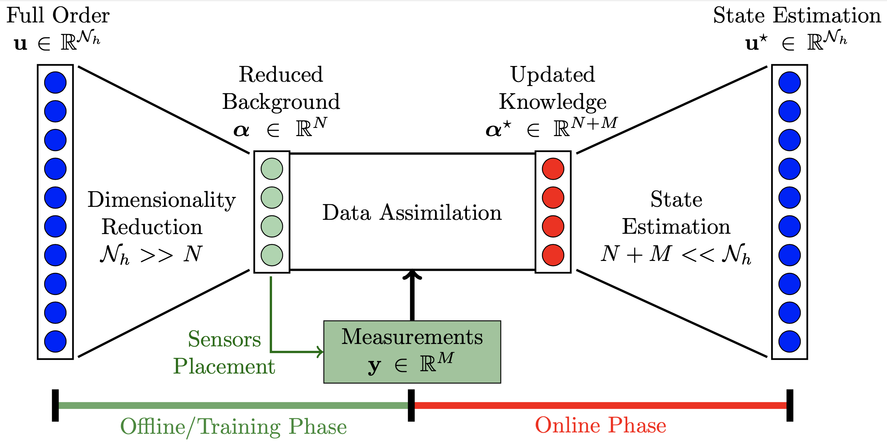

# Welcome to *pyforce*'s documentation

**Authors**: Stefano Riva, Carolina Introini, Antonio Cammi


[](https://doi.org/10.1016/j.apm.2024.06.040) [](https://www.sciencedirect.com/science/article/pii/S002954932400205X)


## Description

*pyforce* is a Python package implementing some Data-Driven Reduced Order Modelling (DDROM) techniques for applications to multi-physics problems, mainly set in the **Nuclear Engineering** world. These techniques have been implemented upon the [dolfinx](https://github.com/FEniCS/dolfinx) package (currently v0.6.0), part of the [FEniCSx](https://fenicsproject.org/) project, to handle mesh generation, integral calculation and functions storage. The package is part of the **ROSE (Reduced Order modelling with data-driven techniques for multi-phySics problEms)**: mathematical algorithms aimed at reducing the complexity of multi-physics models (for nuclear reactors applications), at searching for optimal sensor positions and at integrating real measures to improve the knowledge on the physical systems.

At the moment, the following techniques have been implemented:

- **Proper Orthogonal Decomposition** with Projection and Interpolation for the Online Phase
- **Generalised Empirical Interpolation Method**, either regularised with Tikhonov or not
- **Parameterised-Background Data-Weak formulation**
- an **Indirect Reconstruction** algorithm to reconstruct non-observable fields

This package is aimed to be a valuable tool for other researchers, engineers, and data scientists working in various fields, not only restricted in the Nuclear Engineering world. This documentation includes a brief introduction to the world of Reduced Order Modelling and dimensionality reduction, the API documentation and some examples on how to use the various modules of the package.

This work has been carried out at the [Nuclear Reactors Group - ERMETE Lab](https://github.com/ERMETE-Lab) at [Politecnico di Milano](https://polimi.it), under the supervision of Prof. Antonio Cammi.

---

## How to cite pyforce

If you are going to use *pyforce* in your research work, please cite the following articles.
The authors would be pleased if you could cite the relevant papers:

1. Stefano Riva, Carolina Introini, and Antonio Cammi, “Multi-physics model bias correction with data-driven reduced order techniques: Application to nuclear case studies,” Applied Mathematical Modelling, vol. 135, pp. 243–268, 2024. [https://doi.org/10.1016/j.apm.2024.06.040](https://doi.org/10.1016/j.apm.2024.06.040).
2. Antonio Cammi, Stefano Riva, Carolina Introini, Lorenzo Loi, and Enrico Padovani. Data-driven model order reduction for sensor positioning and indirect reconstruction with noisy data: Application to a circulating fuel reactor. Nuclear Engineering and Design, 421:113105, 2024. doi:[https://doi.org/10.1016/j.nucengdes.2024.113105](https://doi.org/10.1016/j.nucengdes.2024.113105).

For LaTeX users:

```bibtex

@article{RIVA2024_AMM,
title = {Multi-physics model bias correction with data-driven reduced order techniques: Application to nuclear case studies},
journal = {Applied Mathematical Modelling},
volume = {135},
pages = {243-268},
year = {2024},
issn = {0307-904X},
doi = {https://doi.org/10.1016/j.apm.2024.06.040},
url = {https://www.sciencedirect.com/science/article/pii/S0307904X24003196},
author = {Stefano Riva and Carolina Introini and Antonio Cammi},
keywords = {Reduced order modelling, Data driven, Nuclear reactors, Multi-physics, Model correction},
}

@article{CAMMI2024_NED,
title = {Data-driven model order reduction for sensor positioning and indirect reconstruction with noisy data: Application to a Circulating Fuel Reactor},
journal = {Nuclear Engineering and Design},
volume = {421},
pages = {113105},
year = {2024},
issn = {0029-5493},
doi = {https://doi.org/10.1016/j.nucengdes.2024.113105},
url = {https://www.sciencedirect.com/science/article/pii/S002954932400205X},
author = {Antonio Cammi and Stefano Riva and Carolina Introini and Lorenzo Loi and Enrico Padovani},
keywords = {Hybrid Data-Assimilation, Generalized Empirical Interpolation Method, Indirect Reconstruction, Sensors positioning, Molten Salt Fast Reactor, Noisy data},
}

```

---

## What is Reduced Order Modelling?
In scientific literature the expression Reduced Order Modelling (ROM) {cite:p}`Quarteroni2016, MadayChapter2020, Degen2020_conference` is related to a set of techniques devoted to the search for an optimal coordinate system onto which some parametric solutions of Partial Differential Equations (PDEs) -typically called High-Fidelity (HF) or Full Order (FOM) Model - can be represented. These methods are very useful in multi-query and real-time scenarios, when quick and efficient solutions of models are required, e.g. optimization, uncertainty quantification and inverse problems {cite:p}`Guo_Veroy2021, Degen2022`. Recently, with the developments in data-driven modelling a lot of interest in the combination of data and models have been raised. ROM offers new opportunities both to integrate the model with experimental data in real-time and to define methods of sensor positioning, by providing efficient tools to compress the prior knowledge about the system coming from the parametrized mathematical model into low-dimensional forms.

### Reduced Basis Methods
Among all ROM methods, Reduced Basis (RB) {cite:p}`Quarteroni2014, Hesthaven2016, Degen2020_certifiedRB` are a well-established and widely used class of ROM techniques, which are based on an offline-online paradigm. In the offline stage, a set of RB functions {math}`\phi_n(\mathbf{x})` are derived from an ensemble of high-fidelity solutions, called *snapshots*, yielding a low dimensional space that retains the main features of the full-order model. Different approaches can be used to construct the reduced basis, such as the **greedy** algorithms {cite:p}`Maday2006` and the **POD** {cite:p}`Berkooz1993`. Regardless of the construction strategy, an approximation of the high-fidelity solution is sought during the online stage as a linear combination of the RB functions, i.e.

```{math}
    u(\mathbf{x}\;\,\mu) \simeq \sum_{n=1}^N\alpha_n(\mu)\cdot \phi_n(\mathbf{x})
```

According to the methodology for calculating the expansion coefficients {math}`\alpha_n(\mu)` (also called reduced coefficients) of the approximation, RB methods are classified into two categories: *intrusive* and *non-intrusive* RB methods.

- *Intrusive*: the governing equations of the physical system, to which the snapshots are solution, must be known and used during the online step. From a set of PDEs a rather small system of ODEs is derived, typically using a Galerkin projection.
- *Non-Intrusive*: the governing equations knowledge is not required, a more data-driven approach is followed.

This project mainly focuses on the latter since they can be easier extended to the use of real experimental data.

## Data-Driven ROM techniques

Data-Driven Reduced Order Modelling (DDROM) are a set of techniques, which combines theoretical modelling with real data collecting from a physical system. In particular, ROM is seen in a Data Assimilation (DA) framework {cite:p}`DataDrivenScience_book`, so that the theoretical prediction, approximated by ROM, is corrected or updated by experimental evaluations of some fields (e.g., the measure of the temperature in a pipe or the neutron flux in a nuclear reactor).

The general structure of the DDROM methods is reported in the figure below, the methods implemented in this repository can also help in finding the best locations for experimental sensors {cite:p}`RMP_2024`.



The Full Order (FOM) solution is encoded into a reduced coordinate system {cite:p}`NENE2023_RMP, RMP_2024`, ensuring a dimensionality reduction by searching for the dominant physics into the system. This process of encoding can be done through POD, GEIM or other more advanced algorithms and in general represents the heaviest part from the computational point of view. Then, the reduced coordinate system is used to select the most important locations in the domain to place experimental sensors.
Once this is the Data Assimilation process can begin, by combining real measures and the background knowledge in the form of a reduced coordinate system so that an improved system of coordinate is found enabling us to go back to the FOM representation with a decoding process.
