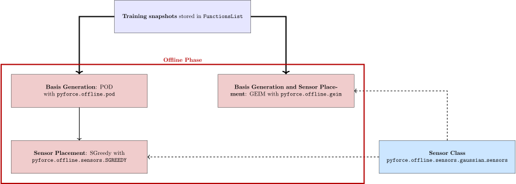
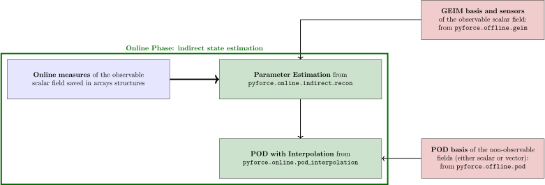

# Theory and package structure
This section presents the main ideas behind Reduced Order Modelling (ROM) {cite:p}`Quarteroni2016, MadayChapter2020, Degen2020_conference`, focusing on data-driven paradigm of these techniques. Then, the structure of the package is presented showing how the different classes are connected to each other.

## What is Reduced Order Modelling?
In scientific literature, the expression Reduced Order Modelling is related to a set of techniques devoted to the search for an optimal coordinate system onto which some parametric solutions of Partial Differential Equations (PDEs) - typically called High-Fidelity (HF) or Full Order Model (FOM) - can be represented. These methods are very useful in multi-query and real-time scenarios, when quick and efficient solutions of models are required, e.g. optimization, uncertainty quantification and inverse problems {cite:p}`Guo_Veroy2021, Degen2022`. Recently, with the developments in data-driven modelling, a lot of interest in the combination of data and models has been raised. ROM offers new opportunities both to integrate the model with experimental data in real-time and to define methods of sensor positioning, by providing efficient tools to compress the prior knowledge about the system coming from the parametrized mathematical model into low-dimensional forms.

### Reduced Basis Methods
Among all ROM methods, Reduced Basis (RB) methods {cite:p}`Quarteroni2014, Hesthaven2016, Degen2020_certifiedRB` are a well-established and widely used class of ROM techniques, which are based on an offline-online paradigm. In the offline stage, a set of RB functions {math}`\phi_n(\mathbf{x})` is derived from an ensemble of high-fidelity solutions, called *snapshots*, yielding a low dimensional space that retains the main features of the full-order model. Different approaches can be used to construct the reduced basis, such as the **greedy** algorithms {cite:p}`Maday2006` and the Proper Orthogonal Decomposition **POD** {cite:p}`Berkooz1993`, directly related to the Singular Value Decomposition (SVD) {cite:p}`DataDrivenScience_book`. Regardless of the construction strategy, an approximation of the high-fidelity solution is sought during the online stage as a linear combination of the RB functions $\{\psi_n(\mathbf{x})\}$, i.e.

```{math}
    u(\mathbf{x}\;\mu) \simeq \sum_{n=1}^N\alpha_n(\mu)\cdot \psi_n(\mathbf{x})
```

According to the methodology for calculating the expansion coefficients {math}`\alpha_n(\mu)` (also called reduced coefficients or latent dynamics) of the approximation, RB methods are classified into two categories: *intrusive* and *non-intrusive* RB methods.

- *Intrusive*: the governing equations of the physical system, to which the snapshots are solution, must be known and used during the online step. From a set of PDEs a rather small system of ODEs is derived, typically using Galerkin projection.
- *Non-Intrusive*: the governing equations knowledge is not required, a more data-driven approach is followed.

*pyforce* mainly focuses on the latter, since they are more suited for extension to include as input real experimental data, such as local measurements.

## Data-Driven ROM techniques

Data-Driven Reduced Order Modelling (DDROM) {cite:p}`RMP_2024, DDMOR_CFR` is a set of techniques, combining theoretical modelling with real data collecting from a physical system. In particular, ROM is seen in a Data Assimilation (DA) framework {cite:p}`DataDrivenScience_book`, so that the theoretical prediction, approximated by ROM, is corrected or updated by experimental evaluations of some fields (e.g., the local measurements of the temperature in a pipe or the neutron flux in a nuclear reactor).

The techniques implemented here follow the same underlying idea expressed in \autoref{fig:darom}. They all share the typical offline/online paradigm of ROM techniques: the former is computationally expensive and it is performed only once, whereas the latter is cheap from the computational point of view and allows to have quick and reliable evaluations of the state of the system by merging background model knowledge and real evaluations of quantities of interest {cite:p}`MadayPBDW`.

During the offline (also called training) phase, a *high-fidelity* or Full Order Model (FOM), usually parameterised partial differential equations, is solved several times to obtain a collections of snapshots $\mathbf{u}_{FOM}\in\mathbb{R}^{\mathcal{N}_h}$, given $\mathcal{N}_h$ the dimension of the spatial mesh, which are dependent on some parameters $\boldsymbol{\mu}_n$; then, these snapshots are used to generate a reduced representation through a set of basis functions $\{\psi_n(\mathbf{x})\}$ of size $N$, in this way the degrees of freedom are decreased from $\mathcal{N}_h$ to $N$, provided that $\mathcal{N}_h>>N$. This allows for an approximation of any solution of the FOM as follows

```{math}
u_{FOM}(\mathbf{x};\boldsymbol{\mu}) \simeq \sum_{n=1}^N\alpha_n(\boldsymbol{\mu})\cdot \psi_n(\mathbf{x})
```

with $\alpha_n(\boldsymbol{\mu})$ as the reduced coefficients, embedding the parametric dependence. Moreover, a reduced representation allows for the search of the optimal positions of sensors in the physical domain in a more efficient manner.

![General scheme of DDROM methods [@RMP_2024].\label{fig:darom}](../images/tie_frighter.svg)

The online phase aims to obtain a quick and reliable way a solution of the FOM for an unseen parameter $\boldsymbol{\mu}^\star$, using as input a set of measurements $\mathbf{y}\in\mathbb{R}^M$. The DDROM online phase produces a novel set of reduced coordinates, $\boldsymbol{\alpha}^\star$, and then computes an improved reconstructed state $\hat{u}_{DDROM}$ through a decoding step that transforms the low-dimensional representation to the high-dimensional one.

## Package structure

The package **pyforce** comprises 3 subpackages: *offline*, *online* and *tools*. The first two collect the main functionalities, in particular the different DDROM techniques; whereas, the last includes importing and storing functions (from *dolfinx* directly or mapping from OpenFOAM), some backend classes for the snapshots and the calculation of integrals/norms. In the following, some figures sketching how the different classes are connected to each other during the offline and online phases.

### Offline Phase
Once the snapshots have been generated and collected into the class `FunctionsList`, the aims of this phase consists in generating a proper reduced representation and obtain an optimal sensors configuration.



### Online Phase
Given the basis functions and the sensors placed in the offline phase, the objective becomes the reconstruction of the state of the system given a set of local measures of some characteristic fields. As reported in {cite:p}`Introini2023_IR, DDMOR_CFR`, the quantities of interest in a nuclear reactor can be quite a few and not all of them can be directly observed; therefore, supposing to have two coupled fields to reconstruct $(\phi, \mathbf{u})$ and only local evaluations of $\phi$ are available, two different problems arise:

- **Direct State Estimation**: from measures of $\phi$, its spatial distribution has to be reconstructed


- **Indirect State Estimation**: from measures of $\phi$, the spatial distribution of $\mathbf{u}$ has to be reconstructed



In the end, there is another possibility which does not include the presence of measures: supposing to know the characteristic (unseen) parameter $\boldsymbol{\mu}^\star$, the full state can be reconstructed using a non-intrusive approach {cite:p}`tezzele_integrated_2022`


